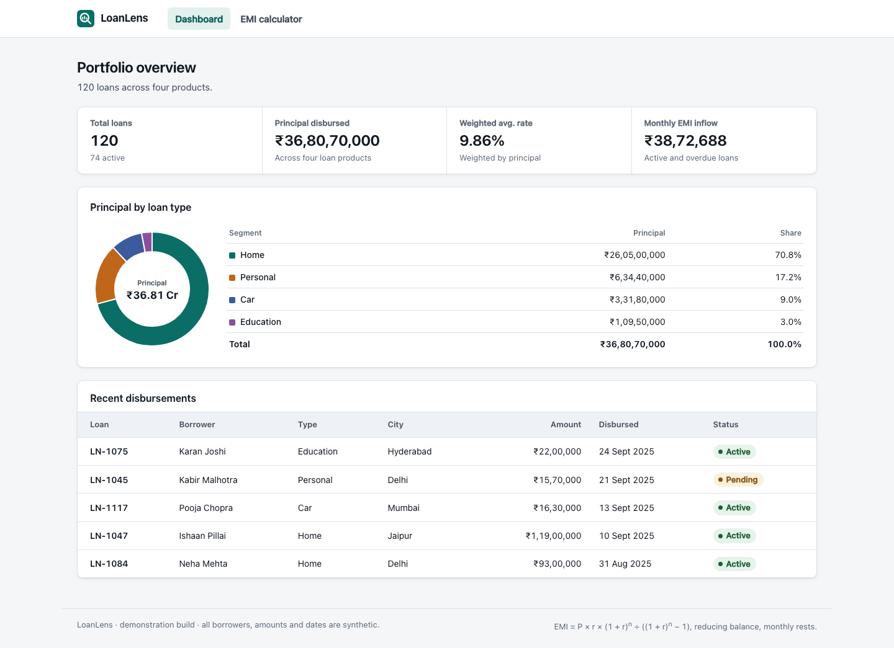
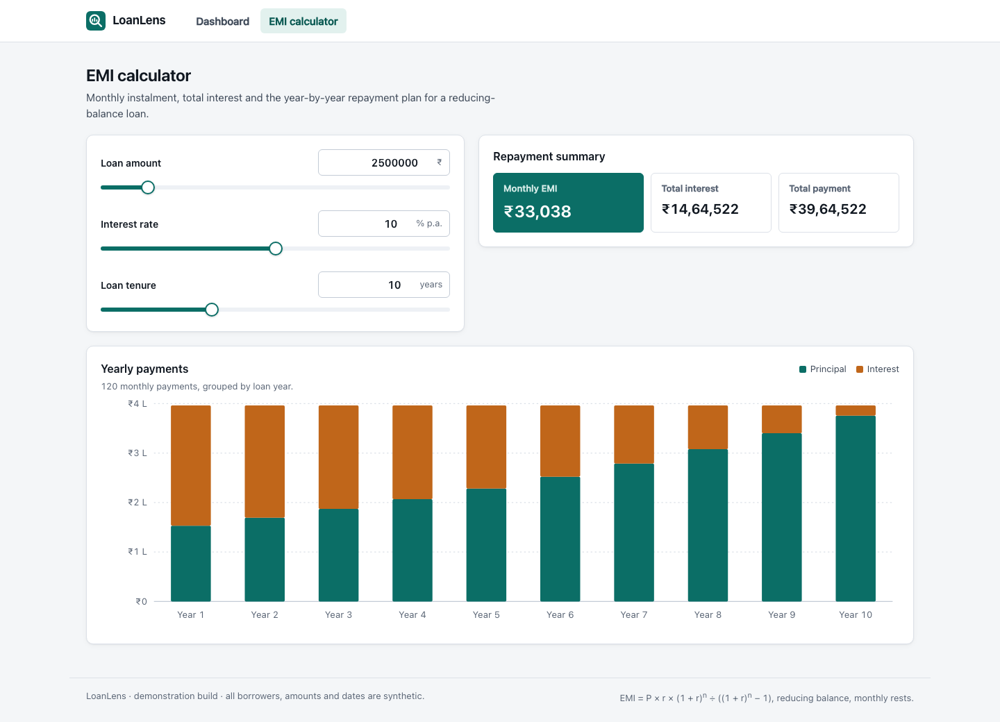
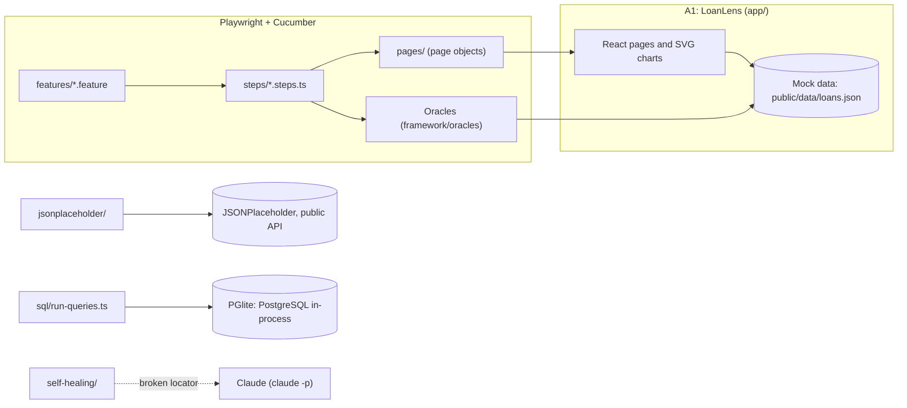

# Streamhub QA Automation Assessment: Section A

My submission for **Section A: web application + UI automation** (A1–A4), with the Playwright framework, the AI self-healing exercise and the Claude Code reflection that every submission needs.

The web app is **LoanLens**: a loan-portfolio dashboard and an EMI calculator, built for this assessment. Its data is a mock JSON file read in the browser, so nothing else needs to run.



## 1. Run it

You need Node 22.12+ (or 24, or 26+) and npm. No database and no API key.

```bash
git clone https://github.com/pratham7711/streamhub-qa-assessment.git
cd streamhub-qa-assessment
npm ci
npx playwright install chromium
npm test
```

On Linux, use `npx playwright install --with-deps chromium` instead: it also installs the system libraries Chromium needs.

`npm test` builds the app, starts it on port 5055 (set `WEB_BASE_URL=http://localhost:<port>` to use another), runs the UI, API and self-healing suites, and writes the results to [`reports/`](reports). It exits with an error only on a failure that is not expected (see below). The JSONPlaceholder tests need internet access.

| Command | What it does |
|---|---|
| `npm run sql` | Runs both A4 queries on PostgreSQL (PGlite, in-process) and writes [`sql/results/`](sql/results) |
| `npm run heal` | The self-healing POC: asks Claude to fix the broken locators. Needs the [Claude Code](https://claude.com/claude-code) CLI, logged in |
| `npm run test:loanlens-ui` (or `test:jsonplaceholder`, `test:self-healing`) | One suite, into the git-ignored `test-results/` |
| `npm run build && npm start` | The app itself, on http://localhost:5055 |

## 2. Results

Last run: 2026-10-08, macOS, Node 26.7. **0 unexpected failures.** Summary: [`reports/SUMMARY.md`](reports/SUMMARY.md).

| Suite | Brief | Scenarios | Passed | Failed on purpose |
|---|---|---|---|---|
| LoanLens UI | A2 | 10 | 10 | 0 |
| JSONPlaceholder | A3 | 10 | 1 | 9: JSONPlaceholder accepts 8 of the 9 invalid posts with `201 Created` and answers the ninth with a `500`. These are [findings](jsonplaceholder/FINDINGS.md), tagged `@known-defect`. |
| Self-healing, healing off | AI exercise | 5 | 0 | 5: the brief asks for these locators to stay broken. |
| Self-healing, `npm run heal` | AI exercise | 5 | 4 | 1: Claude fixed 4. The fifth points at a removed feature, and it correctly refused to guess. |
| SQL (`npm run sql`) | A4 | 2 queries | | 10 and 7 result rows: [`sql/results/`](sql/results) |

Each folder in [`reports/`](reports) holds the HTML report, JSON, JUnit XML, the console log and screenshots, plus a Playwright trace for each failed UI scenario. GitHub shows HTML as source, so open the reports in a browser after cloning.

## 3. The brief, point by point

| The brief asks for | Where it is |
|---|---|
| **Framework:** separate feature, step-definition and page-object files | Each suite has `features/` and `steps/`; the UI suites have `pages/` ([`loanlens-ui/pages`](loanlens-ui/pages)), the API suite an `api/` client. Shared World, hooks and config: [`framework/`](framework). |
| **Framework:** environment configuration, no hardcoded URLs | URLs and timeouts come from [`config/env/.env.local`](config/env/.env.local), read by [`framework/config/env.ts`](framework/config/env.ts) (and by the runner, to start the app at `WEB_BASE_URL`). No URL is written in code. `TEST_ENV=<name>` picks `config/env/.env.<name>`, and real environment variables override the file. |
| **Framework:** dynamic, resilient locators | Role and accessible name first (`getByRole('spinbutton', { name: 'Loan amount' })`), then label and test id. No XPath, no positional CSS. |
| **Self-healing:** 3–5 broken locators, left broken | 5 in [`LegacyLocators.ts`](self-healing/pages/LegacyLocators.ts): a renamed test id, changed link text, an ambiguous label, a positional locator that finds the wrong table, and a removed feature. |
| **Self-healing:** a markdown file on detection, prompt approach and validation | [`docs/SELF_HEALING.md`](docs/SELF_HEALING.md), sections 1–3. |
| **Self-healing:** a working POC (bonus) | `npm run heal`. It detects each failure, asks Claude for a replacement, validates it on the live page, and reports it for review without editing the source. Result: [4 healed, 1 refused](reports/self-healing-healed/healing/SUGGESTIONS.md). |
| **A1:** a dashboard of summarised data | Key figures: total loans, principal disbursed, weighted average rate, monthly EMI inflow ([`Dashboard.tsx`](app/src/pages/Dashboard.tsx)). |
| **A1:** a view driven by user input | The EMI calculator: amount, rate and tenure, each a number box plus a slider ([`Calculator.tsx`](app/src/pages/Calculator.tsx)). |
| **A1:** a chart reflecting the data | A donut of principal by loan type, a recent-loans table, and the calculator's yearly payments bar chart ([`components`](app/src/components)). |
| **A2:** the dashboard loads | [`dashboard.feature:10`](loanlens-ui/features/dashboard.feature#L10) heading, title, key figures and recent loans; [`:21`](loanlens-ui/features/dashboard.feature#L21) navigating to the calculator. |
| **A2:** input, checked against my own computed value | [`calculator.feature:10`](loanlens-ui/features/calculator.feature#L10): ₹25L at 10% for 10 years, ₹50L at 7.5% for 15 and ₹10L at 12% for 5. The EMI is written out in the examples (₹33,038, ₹46,351, ₹22,244), and the EMI, totals and every yearly bar must match [`framework/oracles/emi.ts`](framework/oracles/emi.ts), the suite's own formula, which never imports app code. [`:26`](loanlens-ui/features/calculator.feature#L26): invalid input (`-2383434`, empty, `1e6`, a 50-year tenure) is refused on its field, and fixing it brings the right figures back. |
| **A2:** the chart is visible with non-zero, valid data | [`dashboard.feature:17`](loanlens-ui/features/dashboard.feature#L17): one non-zero slice per loan type, each equal to the loan book's principal, and the legend totals it. The calculator scenarios check one non-zero bar per loan year, each matching the computed schedule and drawn to scale. |
| **A3:** long titles, special characters, missing fields; expect an error code and no server failure | [`create-post.feature`](jsonplaceholder/features/create-post.feature): a valid control, then rows for each of the brief's three inputs (long titles; NUL, invalid UTF-8 and `<script>` markup; a missing userId, a missing title and an empty object `{}`) plus a wrong-type userId, each expecting a 4xx. Write-up: [`FINDINGS.md`](jsonplaceholder/FINDINGS.md). |
| **A4:** round-trip transfers; IPL 30+ streaks; the schema; screenshots of the output | [`sql/README.md`](sql/README.md): queries, schemas, seed data, assumptions, and the [output screenshots](sql/results). |
| **Submission:** README with setup, how to run, architecture; results in the repo | This file, and [`reports/`](reports) plus [`sql/results/`](sql/results). |



## 4. Architecture



- **The app.** React + Vite, served by a small Express server ([`app/server.ts`](app/server.ts)). The dashboard summarises the mock data in the browser ([`loanBook.ts`](app/src/data/loanBook.ts)); the calculator validates its input and works out the plan ([`emi.ts`](app/src/data/emi.ts)).
- **Independent oracles.** Expected values come from [`framework/oracles`](framework/oracles), which reads the same data file and has its own EMI formula. A test that compares the app with its own formula proves nothing. As a check that the tests can fail, I planted a 0.1% error in the app's monthly rate: 8 of the 10 UI scenarios failed.
- **The runner.** [`scripts/run-suite.mjs`](scripts/run-suite.mjs) starts the app if it is not already running and writes one suite's reports. [`scripts/run-all.mjs`](scripts/run-all.mjs) is `npm test`. Failures tagged `@known-defect` or `@broken-locator` stay red in the reports and do not fail the run, but only when they fail for the tagged reason (the API's answer, or the locator's diagnosis). A timeout or a step bug under those tags still fails it, and no assertion was weakened to get a green build.

```
app/              A1: the web app (src/pages, src/components, src/data, public/data/loans.json, server.ts)
loanlens-ui/      A2: features/, steps/, pages/ (page objects), money.ts (rupee assertions)
jsonplaceholder/  A3: features/, steps/, api/ (client and payloads), FINDINGS.md
sql/              A4: queries/, schema/, seed/, results/, run-queries.ts
self-healing/     healer.ts, claude.ts, and the exercise: features/, steps/, pages/LegacyLocators.ts
framework/        World and hooks, config/env.ts, oracles/
config/env/       .env.local, the run profile
reports/          results of the last npm test and npm run heal
```

## 5. Claude Code reflection

**How I used it.** As a pair programmer for the whole project. I described the framework I wanted, and it scaffolded the folders, page objects, step definitions and config. It built LoanLens, drafted the SQL, and checked how JSONPlaceholder actually responds before any test asserted on it. It is also the model behind the self-healing POC.

**What worked.** It is very fast at structure, and at turning a failed run into a good guess about why. It also took steering well:
- Its first version put LoanLens behind an Express API. Section A is about the UI, so I had the app read its mock data in the browser instead.
- Its first tests were mostly happy paths. Then I typed `-2383434` as the loan amount into a public EMI calculator and it simply accepted it, so I asked for real negative testing. That value is now a row in [`calculator.feature`](loanlens-ui/features/calculator.feature), and LoanLens refuses it.
- Left alone, it overbuilds. It kept adding screens, security tests, a mutation check and CI. I cut it back to what the brief asks for.

**What did not.** Its mistakes looked correct, and each one was caught by running something, not by reading it:
- Its first "malformed JSON" test was sending valid JSON, because Playwright re-encodes a string body. That is why the invalid UTF-8 row sends raw bytes.
- The app passed every test on my machine, yet a fresh clone in a hidden folder (`~/.cache`) failed most of the UI tests. Express's `sendFile` refuses any path that contains a dot-folder. Only running the README steps on a clean copy showed it.
- One of its chart checks read a whole table row as one number, gluing `₹36,80,70,000` to `100.0%`. The run failed, and the check now reads the rupee cell.

That is why the expected values come from the suite's own oracles, and why the README steps were run on a clean copy before submitting.

**Notes.** Built and run on macOS (Node 26.7, Chromium via Playwright 1.63). All loan data is synthetic.
