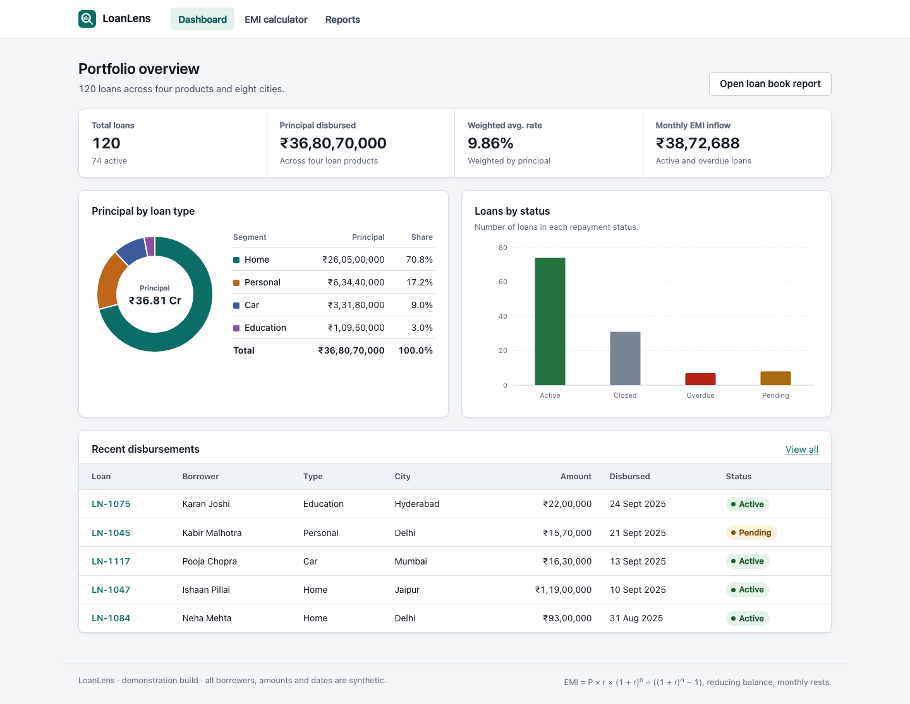

# Section A: Web application + UI automation

Section A of the brief (A1–A4), as a project of its own. It has its own `package.json` and lockfile, test framework, SQL, self-healing engine and reports. Nothing here reads or imports anything outside this folder, so it can be installed, run and graded without Section B.

Its web app, LoanLens, lives in [`app/`](app) and runs on its own mock data: a JSON file shipped with the app and queried in the browser. It makes no API calls.



## Run it

Requirements: Node 22.12+, 24 or 26+ and npm. These are the Node lines Cucumber 13 and Vite support; CI uses 22, and this was developed on 26.7.

```bash
cd sectionA
npm ci
npx playwright install chromium     # the browser Playwright drives
npm test
```

`npm test` does the following:
- builds the web app and starts it;
- runs every suite;
- writes [`reports/SUMMARY.md`](reports/SUMMARY.md), one row per suite.

It exits 1 only on an *unexpected* failure. The red rows it expects are explained in [Findings](#findings).

Nothing else needs installing. The SQL runs on an embedded PostgreSQL (PGlite). The JSONPlaceholder suite needs internet access.

| Command | What it runs |
|---|---|
| `npm test` | Builds the web app, then runs A2 (LoanLens UI), A3 (JSONPlaceholder), A4 (SQL) and the self-healing exercise. Writes [`reports/`](reports). |
| `npm test -- loanlens-ui sql` | Only the named suites, still into `reports/`. The suites are `loanlens-ui`, `jsonplaceholder`, `sql`, `self-healing` and `self-healing-healed`. |
| `npm run test:loanlens-ui`, `test:jsonplaceholder`, `test:sql`, `test:self-healing` | One suite on its own, into the git-ignored `test-results/`. Extra Cucumber arguments pass through, for example `node scripts/run-suite.mjs loanlens-ui --name "Sorting"`. |
| `npm run test:mutation [-- U05 D02 …]` | Plants 18 hand-written bugs in a copy of the web app, one at a time, and checks that the UI suite catches each. Writes [`reports/mutation/SUMMARY.md`](reports/mutation/SUMMARY.md). |
| `npm run heal [-- --provider heuristic\|claude-cli\|anthropic] [--mode suggest]` | The 5 broken locators with healing on. Writes validated patches. |
| `npm run heal:eval [-- --providers heuristic,claude-cli --trials 3]` | Scores the healer against ground truth from the healthy page objects. Writes [`self-healing/eval-results/EVAL.md`](self-healing/eval-results/EVAL.md). |
| `npm run build && npm start` | The app itself, on http://localhost:5055. `npm run dev` runs the Vite dev server on :5174 instead. |
| `npm run data:generate` | Regenerates the mock data from its fixed seed. |
| `npm run typecheck` | Runs `tsc --noEmit` over the app, the tests, the SQL and the healer. |

## Results

Last run: `npm test`, 2026-10-07, macOS, Node 26.7. **0 unexpected failures.** Mutation check (`npm run test:mutation`): **18 of 18 hand-written bugs caught**.

| Suite | Brief | Scenarios | Passed | Failed, expected | Notes |
|---|---|---|---|---|---|
| loanlens-ui | A1/A2 | 57 | 57 | 0 | 346 Gherkin steps. Every scenario that renders a page (53 of 57) also fails if the page throws or the Content-Security-Policy has to block anything. |
| jsonplaceholder | A3 | 36 | 16 | 20 | `@known-defect`: 18 invalid inputs that were not rejected with a 4xx. 2 of them crash the server (500), so they also fail the no-server-error check. |
| sql | A4 | 6 | 6 | 0 | PostgreSQL 18 via PGlite. Each query is checked against a table worked out by hand and against an independent TypeScript oracle. |
| self-healing (healing off) | AI exercise | 5 | 0 | 5 | `@broken-locator`: broken on purpose. |
| self-healing-healed (`npm run heal`) | AI exercise | 5 | 4 | 1 | 4 healed by Claude Sonnet via `claude -p` ($0.021 for the run). The removed feature is correctly refused (`@unhealable`). |

Each suite folder under [`reports/`](reports) holds the Cucumber HTML report, JSON, JUnit XML, the console log and screenshots.

## Where each requirement lives

| Brief | Implementation | Tests |
|---|---|---|
| **A1** Web app with a dashboard, a report view and a chart | [`app/`](app): React + Vite. The dashboard has KPIs, a donut chart and a bar chart. There is a loan book report with filters, sorting and paging, an EMI calculator, and loan detail pages. Charts are hand-rolled accessible SVG. The data is mock data: 120 seeded loans in [`app/public/data/loans.json`](app/public/data/loans.json). [`app/src/data/`](app/src/data) loads them once, then filters, sorts, pages and summarises them in the browser, validating every filter and calculator value. [`app/server.ts`](app/server.ts) serves the built files with the page security headers; it has no API routes. | — |
| **A2** UI tests: navigation, input vs. computed value, chart visible with data | [`loanlens-ui/`](loanlens-ui): [`features/`](loanlens-ui/features), [`steps/`](loanlens-ui/steps), [`pages/`](loanlens-ui/pages) | 57 scenarios. They cover navigation; input vs. computed value; every chart mark's value and label; every bar of the four bar charts drawn to scale; the bar tooltip on hover and on keyboard focus; keystroke-level invalid input; and reflected-XSS sinks under a Content-Security-Policy that fails any scenario it has to block. Figures are read back off the screen as a user sees them (rupees, dates, tenure, via [`display.ts`](loanlens-ui/display.ts)). They are checked against an independent oracle ([`framework/oracles/emi.ts`](framework/oracles/emi.ts), [`framework/oracles/loan-book.ts`](framework/oracles/loan-book.ts)), never against the app's own code. |
| **A3** JSONPlaceholder `POST /posts` with long, special-character and missing-field input | [`jsonplaceholder/`](jsonplaceholder): [`features/`](jsonplaceholder/features), [`steps/`](jsonplaceholder/steps), [`api/`](jsonplaceholder/api) (client and payload catalogue) | 36 scenarios: one per distinct crash risk, one per invalid-input partition, and 4 controls. Findings, with `curl` reproductions: [`jsonplaceholder/FINDINGS.md`](jsonplaceholder/FINDINGS.md). |
| **A4** SQL: round-trip transfers, IPL 30+ streaks, schema, output screenshots | [`sql/`](sql) (see [`sql/README.md`](sql/README.md)) | 6 scenarios on PostgreSQL 18 (in-process PGlite). For each query: the exact result against a hand-worked table and an independent oracle, including near misses that must exist in the seed and stay out of the result; a deliberately wrong query that must be rejected; and the output screenshot. Screenshots: [`sql/results`](sql/results). |
| Framework: feature, step and page files, environment config, resilient locators | [`framework/`](framework) plus the per-suite folders above | URLs and timeouts come from `config/env/.env.<TEST_ENV>`; see [Configuration](#configuration). |
| Self-healing: 3–5 broken locators plus an explanation | The broken locators: [`self-healing/pages/LegacyLocators.ts`](self-healing/pages/LegacyLocators.ts) and [`self-healing/features`](self-healing/features). The healer: [`self-healing/`](self-healing). The explanation: [`docs/SELF_HEALING.md`](docs/SELF_HEALING.md). | 5 locators broken on purpose in a page object for the LoanLens web app. A working POC (Claude via `claude -p`, the Messages API, or an offline heuristic), with validation gates and reviewable patches. |
| Claude Code reflection | [Root README](../README.md#claude-code-reflection) | — |

## Configuration

Nothing is hardcoded. URLs, browser, timeouts and artifacts come from `config/env/.env.<TEST_ENV>`. `local` is the default, and CI uses `TEST_ENV=ci`. A git-ignored `.env.<TEST_ENV>.local` file overrides it, and real environment variables override both.

| Key | Purpose |
|---|---|
| `WEB_PORT`, `WEB_BASE_URL` | Where the web app runs (default :5055). |
| `APP_AUTOSTART` | Whether a run starts the web app when nothing answers at its URL. |
| `JSONPLACEHOLDER_URL` | The external API under test. |
| `BROWSER` (chromium/firefox/webkit), `BROWSER_CHANNEL`, `HEADLESS`, `SLOW_MO`, `VIEWPORT_*` | Browser. |
| `DEFAULT_TIMEOUT_MS`, `STEP_TIMEOUT_MS` | Timeouts. |
| `TRACE` (`retain-on-failure`), `SCREENSHOTS` (`on-failure`) | Artifacts. A failure leaves a screenshot in the report and a Playwright trace in `<reports>/<suite>/traces/`. |
| `REPORTS_DIR` | Where suites write (`test-results` by default; `npm test` uses `reports`). |
| `SELF_HEAL` (off/suggest/heal), `HEAL_PROVIDER`, `HEAL_MODEL` | Self-healing. |

## Design decisions

- **Independent oracles.** A test that compares the app with the app's own formula proves nothing.
  - [`framework/oracles/emi.ts`](framework/oracles/emi.ts) and [`framework/oracles/loan-book.ts`](framework/oracles/loan-book.ts) re-implement the EMI, the amortisation, filtering, sorting and the summaries. They never import app code.
  - The loan-book oracle reads the same mock data file the app reads.
- **Locators.** Role and accessible name come first, then label. Test ids are used only for values that have no accessible name.
  - Outside the deliberately broken legacy page object there is no XPath, no `waitForTimeout` and no `force: true`. `nth()` is used only to walk every point of a chart.
  - The app was built to be testable: real `<table>`s named by their section headings (`aria-labelledby`), named `group` and `figure` elements, and charts whose marks carry accessible names.
- **Evidence.** Every scenario that checks a number attaches the measured and the expected values, plus screenshots. A green run therefore shows *what* was compared, not just that something passed.
- **One app server per run.** `scripts/run-suite.mjs` starts the web app once, before the parallel Cucumber workers spawn. If each worker started one, they would race for the port (see the reflection in the root README).
- **Each rule is tested once, where it lives.** The validation rules run in the browser, in the app's data layer. The UI suite has one row per field, to prove that each refusal lands on the right field in that field's words, rather than a row for every boundary. A row that fails only when another row fails too was cut ([what was cut and why](docs/TEST_DESIGN.md#what-was-cut-and-why)).
- **The tests are proven able to fail.** `npm run test:mutation` plants 18 realistic bugs, one at a time, across the server, the in-browser data layer and the UI. Examples: `'unsafe-inline'` in the CSP, HTML rendering of a URL value, a 360-day year, rupees truncated, dates in the wrong time zone, and chart bars drawn at the wrong height. One of them needed stubbed mock data to reach: no seeded loan has a part-year tenure, so only a stub can show "7 yr 6 mo".
- **Expected failures are tagged, not hidden.** Defects of the public API are `@known-defect`, and the broken locators are `@broken-locator`. `npm test` exits 1 only on untagged failures, so CI stays meaningful without weakening a single assertion.

How the test cases were chosen is in [`docs/TEST_DESIGN.md`](docs/TEST_DESIGN.md): which suite owns which risk, the techniques (partitions, boundaries, error guessing, state transitions), the security tests mapped to OWASP IDs, and the mutation check.

## Findings

### JSONPlaceholder (A3)

Full write-up, with `curl` reproductions: [`jsonplaceholder/FINDINGS.md`](jsonplaceholder/FINDINGS.md).

- **JP-01 (High).** A body over 10 MiB returns **500** with a `PayloadTooLargeError` stack trace. Expected: 413.
- **JP-02 (High).** Malformed JSON returns **500** with a `SyntaxError` stack trace. Expected: 400. Both leak `node_modules` paths.
- **JP-03 to JP-06 (Medium).** No validation at all. Every other invalid input returns **201**:
  - too-long strings;
  - NUL and control characters, and lone surrogates;
  - missing `userId`/`title`/`body`, and `{}`;
  - wrong types and non-existent users.
- **Silently changed data.** Invalid UTF-8 is replaced with U+FFFD. A JSON array is stored as `{"0": …}`. A form body turns `userId` into a string. `text/plain` JSON drops every field.

JSONPlaceholder is a documented fake ("the response is faked as if"), so the validation gaps are expected of it. Measured against the brief's expectation, they are still defects, and the suite reports them that way rather than loosening its assertions. The 20 red rows are 18 invalid inputs that were not rejected with a 4xx; 2 of those also crash the server, so they fail the no-server-error check too.

### LoanLens UI defects found by the same techniques, and fixed

| Where | Found | Now |
|---|---|---|
| Reports | `?page=9999` showed "Showing 99981–120 of 120 loans" | "There is no page 9,999. This report has 12 pages.", with a button to the last page |
| Reports | `?page=abc`, `0` and `-3` were silently ignored | Page 1, with a note naming the bad value |
| Calculator | A tenure of `-2` years said "must be between 1 and 480", with no unit | "…a whole number of months between 1 and 480 (got -24 months)" |
| Calculator | `1e6` said "must be a number"; `--5` said "Enter a loan amount" | "must be written in plain digits", and "must be a number" |
| Calculator | `100000.555` (fractions of a paisa) was accepted | "must have at most 2 decimal places" |
| Pages | No Content-Security-Policy, so the pages could be framed (clickjacking) | `script-src 'self'`, `object-src 'none'` and `frame-ancestors 'none'`. Every UI scenario that renders a page (53 of 57) fails if the policy has to block anything. |
| Loan detail | `/loans/%E0%A4%A` threw `URIError` while building the page title | "Loan not found", naming the value as not a valid loan ID |
| Pages | `POST /` answered 404 with Express's default HTML error page ("Cannot POST /") | 405 with `Allow: GET, HEAD` |

Each fix was reverted on purpose to confirm that its new scenarios fail without it. `npm run test:mutation` repeats that revert automatically for the CSP, the framing header, the page-level 405, `--5`, `1e6`, the decimal page number, the URL escape and the decimal-places rule. It also plants bugs in the in-browser data layer (EMI maths, the inflow figure, search, the city filter, sort direction), which the UI suite has to catch from the screen alone.

## Self-healing locators

[`docs/SELF_HEALING.md`](docs/SELF_HEALING.md) has the full design and the measured results. In short:

- **The broken locators.** There are five, each a different kind of rot: a renamed test id, changed button copy, a label that became ambiguous, a positional locator that silently finds the *wrong* table, and a removed feature. With healing off they fail with a precise diagnosis.
- **What the healer gets.** It sees the declared intent and fingerprint, the failure class, the ARIA snapshot and an element inventory. It answers in a restricted locator vocabulary: never CSS or XPath, and never code.
- **Validation.** Every answer must pass the same gates: unique, visible, matching the fingerprint (role, name, container), and replayed against the oracle-backed assertions. The result is a patch for a person to review. This run produced 4, and every one passes `git apply --check`. The tool never edits source.
- **Evaluated, not just demoed.** `npm run heal:eval` scores each accepted locator against the element the healthy page objects find. It runs 3 trials per case, with the fingerprint shown to the healer (*open*) and withheld (*blind*). Besides the five exercise locators it has two decoy cases built to offer a plausible wrong answer. Over 84 trials there were **0 false heals**, and every removed-feature trial was refused.
  - Claude Sonnet (`claude -p`): 18/18 correct in both conditions, decoys included.
  - Offline heuristic: 18/18 open, 6/18 blind. The validator rejected every wrong candidate it offered (42 of 42 in each condition).
  - Claude never offered a wrong candidate, so the validator is still untested on its answers. Section 5 of `SELF_HEALING.md` has the limits.

## Folder map

```
app/                  A1: the web app. src/pages, src/components, src/data (queries over the mock data),
                      public/data/loans.json (the mock data), server.ts (serves the build)
loanlens-ui/          A2: features/, steps/, pages/ (Page Objects), display.ts (reads figures back as a user sees them)
jsonplaceholder/      A3: features/, steps/, api/ (client + payload catalogue), FINDINGS.md
sql/                  A4: schema, seed, queries, deliberately wrong queries, oracle, features/, steps/, results/
self-healing/         the healer (runtime, providers, validation, patch writer, eval.ts, eval-results/) and its
                      exercise: features/, steps/, pages/LegacyLocators.ts (5 broken locators)
framework/            World, hooks (browser, tracing, starting the web app), config/env.ts, base API client, shared API steps, oracles/
config/env/           .env.local, .env.ci, .env.example
scripts/              run-suite.mjs (one suite), run-all.mjs (npm test + SUMMARY.md), mutation-check.mjs, generate-loans.ts
docs/                 TEST_DESIGN.md, SELF_HEALING.md, self-healing-runs/ (the offline heuristic's saved run), screenshots/
reports/              results of the last `npm test` and of the mutation check (committed evidence)
```

The Claude Code reflection, which covers both sections, is in the [root README](../README.md#claude-code-reflection).
